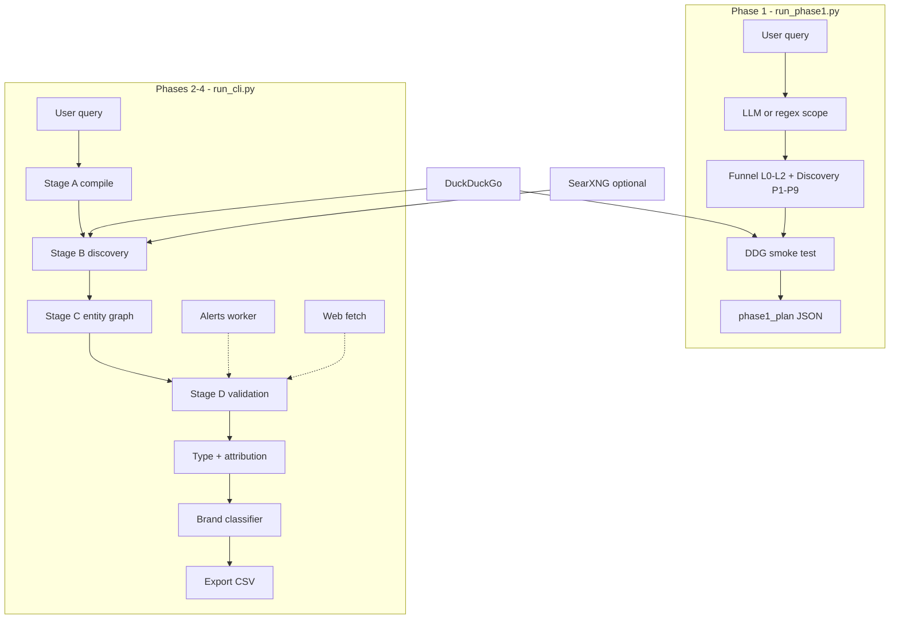

# Vendor Intelligence — Planning, Architecture & Implementation Status

This document is the **master plan**: what the platform is supposed to do, what each phase delivers, **what is already implemented**, what is partial, and what remains for formal test (Phase 5).

**Companion docs:**

| Document | Use when |
|----------|----------|
| [README.md](README.md) | Quick start, commands, overview |
| [PROJECT_HANDOFF.md](PROJECT_HANDOFF.md) | Day-to-day handoff, Phase 1 JSON fields, next steps |
| [LIVE_SETUP.md](LIVE_SETUP.md) | API keys, SearXNG, Google Alerts, troubleshooting |

---

## 1. Executive summary

**Vendor Intelligence** turns one natural-language question (e.g. “best pharmaceutical companies in India”) into a **validated, explained company list** exported as CSV — using **free** search, **backend-only** scraping, optional Google Alerts articles, one LLM call per run for query planning, and rule-based validation.

| Dimension | Choice |
|-----------|--------|
| **Build window** | Days 1–3: Phases 1–4 · Days 4–5: Phase 5 test only |
| **Search** | DuckDuckGo primary (`ddgs` package) → SearXNG backup |
| **LLM** | 1 call/run (OpenCode Zen, Anthropic, Gemini, or Groq via `.env`) |
| **Scraping** | Backend only: company websites + Google Alerts worker |
| **Storage** | File-based outputs (`output/`); no PostgreSQL in this plan |
| **Paid APIs** | Out of scope (Brave, SerpAPI, Tavily, Firecrawl, etc.) |

---

## 2. Schedule (fixed)

| Period | Days | Mode |
|--------|------|------|
| **Build** | **Day 1 · Day 2 · Day 3** | Implement Phases 1–4. **No formal test-phase work.** |
| **Test** | **Day 4 · Day 5** | Phase 5 only — verify, fix defects, demo. **No new features.** |

**End of Day 3:** Phases 1–4 code complete, one live export path works.  
**End of Day 5:** Signed off with test evidence and demo pack.

---

## 3. Scope — in plan

| Area | Approach | Cost |
|------|----------|------|
| Free search | DuckDuckGo → SearXNG backup | $0 |
| Query understanding | LLM **1 call/run** (+ regex fallback) | Minimal |
| Discovery + funnel | L0 → L2 search prompts; L3 = per-entity proof via scrape/news | $0 |
| Backend scrape — **company sites** | httpx + text extraction for gates, type, sources | $0 |
| Backend scrape — **Google Alerts** | Worker stores article title/URL/snippet | $0 |
| Enrichment | Wikidata parent lookup | $0 |
| News / activity | DDG news + RSS + Alerts articles | $0 |
| Validation | 5 gates (search + scrape + alerts) | $0 |
| Company type | Manufacturer, distributor, retailer, … | $0 |
| Source attribution | `inclusion_reason`, `inclusion_sources`, `funnel_levels_seen` | $0 |
| Export | 4 CSV files per run | $0 |
| **Competitor discovery** | Search prompts for market competitors + named anchor company | $0 |

---

## 4. Scope — explicitly out of plan

| Item | Note |
|------|------|
| Dashboard / frontend UI | Later |
| PostgreSQL / long-term DB | Later; Alerts can use JSON store |
| Paid search/news/scrape APIs | Not in submission design |
| Extra LLM calls per company | Off by default |
| Scraping from browser UI | Backend pipeline only |
| Hardcoded country/industry lists in query parsing | **Removed** — generic parsing only |

**Google Alerts is IN scope** — backend worker + activity gate + article URLs in sources.

---

## 5. Requirements (R0–R3)

| ID | Requirement | Meaning |
|----|-------------|---------|
| **R0** | Data plane | Free search, backend scrape (sites + Alerts), Wikidata, news |
| **R1** | Funnel | L0 broad → L1 category → L2 segment → L3 per-company proof |
| **R2** | Company type | Classify role; filter by query intent (e.g. manufacturers only) |
| **R3** | Attribution | Every exported row: why included + evidence URLs + funnel levels |

---

## 6. Pipeline phases — planned deliverables

### Phase 1 — Foundation & free search (Build · Days 1–3)

**Planned goal:** Query plan + funnel themes + free search router verified before full discovery.

| Planned work | Req |
|--------------|-----|
| Mock vs live mode | R0 |
| DuckDuckGo + SearXNG router | R0 |
| LLM query compiler (1 call) | R0 |
| Funnel L0–L3 defined; L0–L2 in plan output | R1 |
| Export column spec for later CSV | R3 |
| Sign-off: search smoke test on plan prompts | R0 |

**Planned exit:** Search works; JSON plan documents scope, prompts, sample hits.

---

### Phase 2 — Discovery & backend website scraping (Build · Days 1–3)

**Planned goal:** Find companies L0→L2; fetch official sites in backend.

| Planned work | Req |
|--------------|-----|
| Run discovery per funnel + discovery prompts | R1, R0 |
| Tag `funnel_level` / `levels_seen` per hit | R1 |
| Backend fetch company pages | R0 |
| Text for gates in Phase 3 | R0 |

**Planned exit:** `discovery_hits` with URLs; site text available for validation.

---

### Phase 3 — Validation, enrichment & Google Alerts (Build · Days 1–3)

**Planned goal:** Five gates, parents, activity from news + Alerts.

| Planned work | Req |
|--------------|-----|
| Gates: operational, geography, product, activity, M&A | R0 |
| Use search snippets + website text | R0 |
| Wikidata parents | R0 |
| Google Alerts worker + activity matching | R0 |
| Tiers A / B / C; hard exclusions | R0 |

**Planned exit:** Validated entities with evidence; Alerts articles in activity gate.

---

### Phase 4 — Company type, sources & export (Build · end of Day 3)

**Planned goal:** Filter, explain, export CSV with all columns.

| Planned work | Req |
|--------------|-----|
| `company_type` + intent filter | R2 |
| `inclusion_reason`, `inclusion_sources`, `funnel_levels_seen` | R3 |
| Wire Phases 1–4 in `run_cli.py` | All |
| Brand rules + quality gate | R0 |
| Mock + one live smoke export | All |

**Planned exit:** **Build complete** — `output/{run_id}_{slug}/` with four CSVs.

---

### Phase 5 — Test & sign-off (Test · Days 4–5 only)

| Day | Focus |
|-----|--------|
| **Day 4** | Execute test matrix; log defects |
| **Day 5** | Fix defects; re-test; demo; sign-off |

| Check | Pass criteria |
|-------|----------------|
| Free search | DDG works; SearXNG helps when thin |
| Website scrape | Sites fetched; URLs in export |
| Google Alerts | Worker runs; activity uses articles |
| Funnel R1 | L0–L2 sensible on sample queries |
| Type R2 | Manufacturer queries exclude retailers where configured |
| Sources R3 | Reason + URLs on every row |
| Cost | 1 LLM call per live run |
| Regression | Mock mode still works |

---

## 7. Implementation status (detailed — current codebase)

Legend: **Done** = implemented and wired · **Partial** = code exists, needs live verification or quality tuning · **Planned** = spec only / not started

### 7.1 Phase 1 — Foundation & free search

| Component | Status | Location / notes |
|-----------|--------|------------------|
| `run_phase1.py` CLI | **Done** | `--live` / `--mock` |
| Phase 1 JSON manifest | **Done** | `output/phase1/phase1_plan_*.json` |
| DuckDuckGo search (`ddgs`) | **Done** | Retries, offline detection, no crash on API errors |
| SearXNG backup | **Done** | `search_router.py` — needs Docker at `:8080` |
| LLM query compiler | **Done** | `a_compiler.py` — OpenCode/Anthropic/Gemini/Groq |
| Regex fallback scope | **Done** | When LLM fails or returns bad JSON |
| Generic geo parsing | **Done** | `in Region, Country` and `in Place` — no country whitelist |
| `scope.search_topic` | **Done** | Short phrase for search + filters |
| Funnel prompts L0–L2 | **Done** | `prompt_builder.py` |
| Discovery prompts (up to 9) | **Done** | Includes **competitor** angles first |
| Competitor prompts (market) | **Done** | e.g. `{topic} competitors {geo}` |
| Competitor prompts (anchor company) | **Done** | From `competitors of X` / `alternatives to X` in query |
| Funnel L2 = top competitors | **Done** | Generic, not industry-specific |
| Search smoke test in JSON | **Done** | Per-prompt counts + 3 samples |
| Adaptive relevance filter | **Done** | Strict → relaxed → fallback passes |
| Network/DNS preflight warning | **Done** | Phase 1 warns when offline |
| Export column spec in JSON | **Done** | From `config/export_columns.yaml` |
| Unit tests (parsing/prompts) | **Done** | `tests/test_query_intent.py` (10 tests) |

**Phase 1 does not:** produce `company_list.csv`, scrape sites, or run full validation.

---

### 7.2 Phase 2 — Discovery

| Component | Status | Location / notes |
|-----------|--------|------------------|
| `run_phase2.py` + phase2 runner | **Done** | `phase2/runner.py` — plan reuse, scrape, JSON export |
| Stage B discovery | **Done** | `stages/b_discovery.py` |
| Uses funnel + discovery prompts | **Done** | Merged prompt list (up to 12 searches) |
| Passes `search_topic` to filter | **Done** | Wired in discovery + router |
| Widen prompts if &lt; 40 names | **Done** | Generic widen incl. competitors |
| Mock discovery hits | **Done** | `mock/fixtures.py` |
| Live search in orchestrator | **Done** | `orchestrator.py` → `run_discovery` |

---

### 7.3 Phase 3 — Validation & enrichment

| Component | Status | Location / notes |
|-----------|--------|------------------|
| Stage D validation (5 gates) | **Done** | `stages/d_validation.py` |
| Wikidata integration | **Partial** | Hook in clients; depends on `WIKIDATA_ENABLED` |
| Web fetch for sites | **Partial** | `WEB_FETCH_ENABLED` in `.env` |
| Google Alerts worker script | **Done** | `scripts/run_alerts_worker.py` |
| Alerts store read in pipeline | **Partial** | Needs RSS URLs or worker run + `GOOGLE_ALERTS_ENABLED` |
| DDG news / RSS | **Partial** | Config flags; verify on live runs |

---

### 7.4 Phase 4 — Type, attribution, export

| Component | Status | Location / notes |
|-----------|--------|------------------|
| Company type classification | **Done** | `classification/company_type.py` |
| Intent filter (manufacturers, etc.) | **Done** | `filter_entities_by_intent` |
| Inclusion reason builder | **Done** | `attribution/builder.py` |
| Inclusion sources aggregation | **Done** | Discovery + validation URLs |
| `funnel_levels_seen` on entities | **Done** | Dedupe in `utils/dedupe.py` |
| Brand classifier (BBK, Xiaomi, …) | **Done** | `stages/f_brand_classifier.py` |
| CSV export (4 files) | **Done** | `export_csv.py` |
| Full orchestrator A→B→C→D→F→G→I | **Done** | `orchestrator.py` |
| `run_cli.py` entry | **Done** | Full pipeline |
| REST API (optional) | **Done** | `vendor_intel.api` + uvicorn |

---

### 7.5 Phase 5 — Test

| Component | Status |
|-----------|--------|
| Formal test matrix execution | **Planned** (Days 4–5) |
| Automated regression suite (e2e) | **Partial** — unit tests only for funnel |
| Demo pack / sign-off doc | **Planned** |

---

## 8. What was built during implementation (changelog summary)

This section records **engineering work beyond the original skeleton** — important for anyone continuing the project.

### 8.1 Infrastructure & live mode

- Single `requirements.txt` for all dependencies (`ddgs`, httpx, selenium, etc.).
- `.env` loading with overrides beating `default.yaml` (fixes `GOOGLE_ALERTS_ENABLED` false bug).
- `validate_live_settings()` after env load (fixes false “LLM key missing”).
- Multi-provider LLM: `opencode`, `anthropic`, `gemini`, `groq` via `LLM_PROVIDER`.

### 8.2 Phase 1 quality (generic — no industry hardcoding)

| Problem (before) | Fix (after) |
|------------------|-------------|
| Geo stuck as `global` for `in Assam, India` | Parse `in Region, Country` generically |
| Market string included full geography | Split `market` vs `geographies` + `search_topic` |
| Duplicate prompts (`suppliers suppliers`) | Role-word dedup in `prompt_builder.py` |
| `emerging` → dictionary spam | Removed; use `fast-growing` or competitor angles |
| L0–L2 duplicated inside discovery list | Discovery = P1–P9 only; funnel separate |
| Iceland “modular” → modular.com | Drop ambiguous modifiers; require cooling tokens in filter |
| Kelp → 0–1 results | Adaptive filter relaxes when too few hits |
| DDG DNS crash spam | Retry + offline flag + one warning |
| Phase 2 ignored funnel prompts | `b_discovery` runs funnel + discovery |
| Phase 2 ignored `search_topic` | Passed to `search_router.search()` |

### 8.3 Competitor discovery (latest)

- **Market-level:** `{search_topic} competitors {geo}`, `top … competitors`, `competitive landscape`.
- **Anchor company** (from query text): `{company} competitors`, `competitors of {company}`.
- **Funnel L2:** `top {topic} competitors {geo}`.
- **Scope field:** `anchor_company`, `intent: competitor_set` when detected.
- Up to **9 discovery prompts**; Phase 1 runs up to **12 searches** (3 funnel + 9 discovery).

### 8.4 Documentation & cleanup

- Removed obsolete docs (`PROJECT_SUBMISSION.md`, etc.).
- Added `PROJECT_HANDOFF.md`, updated `LIVE_SETUP.md`, `README.md`.
- This file: implementation tracker.

---

## 9. Phase 1 JSON artifact (contract for Phase 2+)

Every `run_phase1.py --live` run produces:

```json
{
  "phase": 1,
  "query": "...",
  "scope": {
    "market": "...",
    "search_topic": "...",
    "geographies": ["..."],
    "anchor_company": "optional",
    "intent": "market_map | competitor_set",
    "scope_source": "llm | regex_fallback"
  },
  "funnel_prompts": [ { "id": "L0|L1|L2", "text": "..." } ],
  "discovery_prompts": [ { "id": "P1..P9", "text": "..." } ],
  "search_smoke_test": { "L0": { "result_count", "sample": [...] }, ... },
  "export_column_spec": { ... },
  "warnings": [ ... ]
}
```

**Rule:** Do not run full pipeline on a query whose Phase 1 smoke test is all zeros (check network) or clearly wrong geography.

---

## 10. Full pipeline flow (as implemented)

```text
User query
  → [A] compile_query (LLM 1x or regex fallback)
  → merge_funnel_into_config (scope, funnel L0–L2, discovery P1–P9)
  → [B] run_discovery (funnel + discovery + widen; DDG/SearXNG)
  → [C] run_entity_graph (dedupe, domains, parents prep)
  → [D] run_validation (5 gates, tiers, exclusions)
  → classify_entity + filter_entities_by_intent
  → apply_attribution (reason + sources + funnel_levels_seen)
  → [F] run_brand_classifier (parent/sibling rules)
  → [G] apply_listing_and_select → CompanyCandidate list
  → [I] run_quality_gate (duplicates, min count warnings)
  → export_pipeline_csv (4 files under output/)
```

### Funnel levels (R1)

| Level | Role in code | Example prompt shape |
|-------|------------|----------------------|
| **L0** | Broad universe | `{topic} companies {geo}` |
| **L1** | Manufacturers / OEM / suppliers | `{topic} manufacturers {geo}` |
| **L2** | Competitors / leaders | `top {topic} competitors {geo}` |
| **L3** | Per-entity | Site scrape + news/Alerts in validation |

### Discovery prompts (typical order)

1. `{topic} competitors {geo}`  
2. `top {topic} competitors {geo}`  
3. `{topic} competitive landscape {geo}`  
4. Optional: `{anchor} competitors {geo}` if anchor in query  
5. `{topic} companies`, `suppliers`, `manufacturers`, `B2B directory`, `vendors` (variant phrasing)

---

## 11. Export columns (Phase 4 — implemented)

From `config/export_columns.yaml` / `export_csv.py`:

**company_list.csv**

| Column | Source |
|--------|--------|
| `display_name` | Resolved entity name |
| `parent_group` | Wikidata / classifier |
| `primary_domain` | Discovery URL domain |
| `company_type` | R2 classifier |
| `tier` | Validation A/B/C |
| `score` | Ranking score |
| `inclusion_reason` | R3 attribution builder |
| `inclusion_sources` | Pipe-separated URLs |
| `funnel_levels_seen` | Pipe-separated L0/L1/L2 |
| `evidence_urls` | Gate evidence |

**Also:** `parent_group_list.csv`, `suppressed_brands.csv`, `run_summary.csv`.

---

## 12. What you can do today (capability matrix)

| Action | Command | Output |
|--------|---------|--------|
| Test query plan only | `run_phase1.py --live "query"` | JSON in `output/phase1/` |
| Discovery only (Phase 2) | `run_phase2.py --live --from-plan output/phase1/...json` | JSON in `output/phase2/` |
| Full live pipeline | `run_cli.py --live "query"` | CSVs in `output/{run_id}_*/` |
| Mock demo (no keys) | `run_cli.py --mock "query"` | Demo companies |
| Unit tests | `python -m unittest tests.test_query_intent` | Pass/fail |
| Google Alerts collect | `scripts/run_alerts_worker.py` | `data/alerts/articles.json` |
| API run | `uvicorn vendor_intel.api:app --app-dir src` | POST `/v1/runs` |
| SearXNG backup | Docker on port 8080 | Extra search results |

---

## 13. Architecture diagram



---

## 14. Backend scraping (confirmed in plan)

| Source | Collection | Consumed by |
|--------|------------|-------------|
| Company websites | httpx fetch + text extract | Gates, type, sources |
| Google Alerts worker | Selenium → articles JSON | Activity gate, sources |
| DuckDuckGo news | Search module | Activity gate |

**Not in scope:** UI-driven scrape, Firecrawl, paid APIs.

---

## 15. Google Alerts (in scope)

1. Configure `GOOGLE_ALERTS_*` in `.env` (see [LIVE_SETUP.md](LIVE_SETUP.md)).
2. Run `scripts/run_alerts_worker.py` (first time: `GOOGLE_ALERTS_HEADLESS=false` for login).
3. Pipeline reads `data/alerts/articles.json` when `GOOGLE_ALERTS_ENABLED=true`.

Used for: **activity gate**, name matching, **inclusion_sources** article URLs.

---

## 16. Out of scope (unchanged)

| Item | Note |
|------|------|
| Dashboard UI | Later |
| PostgreSQL | Later |
| Paid APIs | Brave, SerpAPI, Tavily, NewsAPI, Firecrawl |
| Extra LLM per entity | Off by default |

---

## 17. Success criteria

| Milestone | Criteria |
|-----------|----------|
| **End of Day 3 (build)** | `run_cli.py --live` produces CSV with type, reason, sources, funnel levels; Phase 1 JSON sane |
| **End of Day 5 (test)** | Phase 5 checklist passed; defects fixed; demo ready |

---

## 18. Source code map

| Path | Responsibility |
|------|----------------|
| `run_phase1.py` | Phase 1 CLI |
| `run_phase2.py` | Phase 2 CLI |
| `run_cli.py` | Full pipeline CLI |
| `src/vendor_intel/phase1/runner.py` | Phase 1 manifest writer |
| `src/vendor_intel/orchestrator.py` | Pipeline coordinator |
| `src/vendor_intel/stages/a_compiler.py` | LLM JSON compile |
| `src/vendor_intel/stages/b_discovery.py` | Live discovery |
| `src/vendor_intel/stages/c_entity_graph.py` | Dedupe / graph |
| `src/vendor_intel/stages/d_validation.py` | Five gates |
| `src/vendor_intel/stages/f_brand_classifier.py` | Parent brand rules |
| `src/vendor_intel/stages/g_output.py` | Final lists |
| `src/vendor_intel/stages/i_quality.py` | Quality checks |
| `src/vendor_intel/funnel/query_intent.py` | Market/geo parse |
| `src/vendor_intel/funnel/prompt_builder.py` | All search prompts |
| `src/vendor_intel/funnel/levels.py` | Merge funnel into config |
| `src/vendor_intel/clients/search_router.py` | DDG + SearXNG |
| `src/vendor_intel/clients/search_relevance.py` | Result filtering |
| `src/vendor_intel/clients/duckduckgo.py` | DDG client |
| `src/vendor_intel/export_csv.py` | CSV writer |
| `src/vendor_intel/alerts/` | Google Alerts worker |
| `config/default.yaml` | Defaults |
| `config/export_columns.yaml` | CSV schema |

---

## 19. Recommended next steps (from current state)

1. **Re-run Phase 1** on important queries after competitor + filter updates.  
2. **Start SearXNG** if DuckDuckGo is thin or flaky.  
3. **Run one full live pipeline** on a query with good Phase 1 smoke test (e.g. pharma India, Eri silk Assam).  
4. **Configure Alerts** if activity gate matters for demo.  
5. **Execute Phase 5 checklist** (Days 4–5) — record results in a test log (create if needed).

---

*This document should be updated when Phase 5 test results or major features land.*
