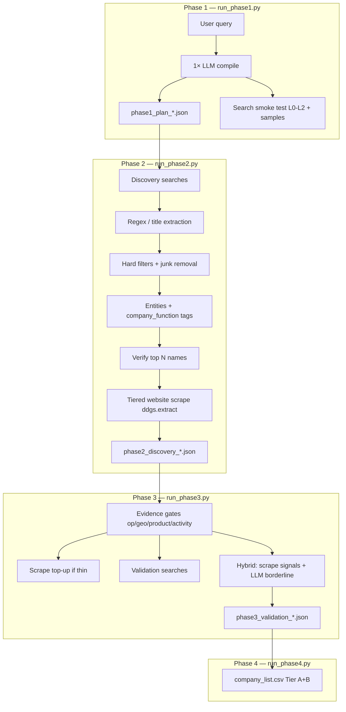

# Vendor Intelligence — Project Handoff (Current System)

**Last updated:** May 2026  
**Purpose:** Single detailed reference for what the pipeline does **today**, how to run it, how pieces connect, and what was tuned during pharma / market runs.

**Related docs:** [PLANNING_HLD_LLD.md](PLANNING_HLD_LLD.md) · [README.md](README.md) · [LIVE_SETUP.md](LIVE_SETUP.md)

---

## 1. North star

Turn a natural-language market question into a **validated company landscape**:

| Goal | Target |
|------|--------|
| Output quality | **50–70 Tier A + B** companies with evidence |
| Precision | Strict junk/blocklist/entity validation — **do not relax** to inflate counts |
| Recall | Phase 2 discovery + yield-aware stop (not unbounded 500-prompt runs) |
| Cost | **1 LLM call** in Phase 1; Phase 3 uses capped agentic batches |
| Search/scrape | Free stack: **ddgs** + Bing HTML + optional SearXNG + `ddgs.extract` scrape |

**Typical query types:** geo-specific landscapes (e.g. pharmaceutical companies in India) or market reports (e.g. Bio Based Ethylene Market, Atomic Clock Market).

---

## 2. End-to-end architecture



**Recommended production path:** Run **Phase 1 → 2 → 3 → 4** separately (not only `run_cli.py`), so you can inspect JSON between stages.

---

## 3. Project layout

```
project/
├── run_phase1.py              # Phase 1: plan + smoke test
├── run_phase2.py              # Phase 2: discovery + verify + scrape
├── run_phase3.py              # Phase 3: validation gates + hybrid LLM
├── run_phase4.py              # Phase 4: CSV from Phase 3 JSON
├── run_cli.py                 # Optional: full pipeline in one command
├── setup.bat                  # venv + pip
├── requirements.txt
├── .env / .env.example        # Secrets + tuning (never commit .env)
├── config/
│   ├── default.yaml           # Base thresholds, junk_filters, blocked domains
│   ├── export_columns.yaml    # CSV columns
│   └── prompts/
│       ├── compiler_system.txt
│       └── validation_adjudicator_system.txt
├── output/
│   ├── phase1/phase1_plan_<slug>.json
│   ├── phase2/phase2_discovery_<slug>.json
│   ├── phase3/phase3_validation_<slug>.json
│   └── {run_id}_{query_slug}/   # Phase 4 CSV folder
├── src/vendor_intel/
│   ├── phase1/runner.py
│   ├── phase2/runner.py
│   ├── phase3/runner.py
│   ├── phase4/runner.py
│   ├── stages/
│   │   ├── a_compiler.py      # LLM query compiler
│   │   ├── b_discovery.py     # Discovery loop + yield stop
│   │   └── d_validation.py    # Gates + tier assignment
│   ├── discovery/
│   │   ├── entity_extract.py  # Names from SERP, validation helpers
│   │   ├── entity_scoring.py  # is_bad_phrase, rank for verify
│   │   ├── company_verify.py  # Pre-scrape name verification
│   │   ├── candidate_quality.py / function_enrichment.py
│   │   ├── discovery_query_engine.py  # query_cache_key, yield tracker
│   │   ├── sector_tree.py     # Sub-sector discovery prompts
│   │   └── volume_prompts.py
│   ├── validation/
│   │   ├── validation_agent.py    # Hybrid LLM adjudication
│   │   ├── scrape_signals.py
│   │   └── site_kind.py
│   ├── clients/
│   │   ├── search_router.py   # ddgs → Bing → SearXNG → Wikipedia
│   │   ├── duckduckgo.py      # ddgs.text + worker pool
│   │   ├── ddg_worker_pool.py # Process pool (DDG_WORKER_COUNT)
│   │   ├── bing_html.py
│   │   └── searxng.py
│   ├── scraping/website.py    # ddgs.extract (+ optional Selenium)
│   └── funnel/                # query_intent, prompt_builder, scope
└── tests/test_query_intent.py
```

---

## 4. Output file naming (critical)

Filenames use **`{market}_{geography}`** from the Phase 1 **scope**, not your raw query string.

```text
slug = normalize(scope.market + "_" + scope.geographies[0])
→ phase1_plan_{slug}.json
→ phase2_discovery_{slug}.json
→ phase3_validation_{slug}.json
```

**Example:** Query `"Bio Based Ethylene Market"` may produce  
`phase1_plan_bio_based_ethylene_brazil.json` if the LLM sets geo to Brazil — **not** `_global`.

**Always** after Phase 1:

```powershell
Get-ChildItem output\phase1\phase1_plan_* | Sort-Object LastWriteTime -Descending | Select-Object -First 5
```

Use that exact path in `--from-plan` / `--from-discovery` / `--from-validation`.

---

## 5. Phase 1 — Query plan (keep as is)

### Command

```powershell
cd c:\Users\khushi\Desktop\project
.venv\Scripts\python.exe run_phase1.py --live "your query here"
```

### What happens

1. Load `.env` (`USE_MOCK_DATA=false` for live).
2. **One LLM call** (OpenCode / Anthropic / Gemini / Groq) via `a_compiler.py` + `config/prompts/compiler_system.txt`.
3. Regex fallback if LLM JSON fails (`scope_source: regex_fallback`).
4. Build **scope**: `market`, `search_topic`, `geographies`, `ecosystem_functions`, `relevance_keywords`, `negative_keywords`, optional `anchor_company`.
5. Build **funnel** L0–L2 + **discovery** prompts (plan IDs like ST*, P*, sector tree — no listicle wording in compiler guidance).
6. **Smoke test**: sample searches per prompt → `search_smoke_test` with result counts + sample URLs.
7. Write `output/phase1/phase1_plan_{slug}.json`.

### What Phase 1 does NOT do

- No company CSV, no deep scrape, no validation gates.

### Phase 1 JSON — key fields

| Field | Use |
|-------|-----|
| `query` | Original user text |
| `scope.market` | Full industry phrase |
| `scope.search_topic` | Short phrase for search filters |
| `scope.geographies` | e.g. `["India"]`, `["Brazil"]`, `["global"]` |
| `scope.ecosystem_functions` | Roles to discover (manufacturer, distributor, …) |
| `funnel_prompts` | L0, L1, L2 |
| `discovery_prompts` | ST*, P*, volume prompts |
| `search_smoke_test` | Quality check before Phase 2 |
| `plan_path` | Absolute path to this file |

---

## 6. Phase 2 — Discovery + entity build + scrape

### Command

```powershell
.venv\Scripts\python.exe run_phase2.py --live --from-plan output\phase1\phase1_plan_<slug>.json --max-scrape 80
```

Flags: `--no-scrape` (skip site fetch), `--mock` (no network).

### Flow (detailed)

1. **Load Phase 1 plan** (`load_phase1_plan`) — scope, funnel, discovery prompts.
2. **Merge global junk** from `default.yaml` into scope.
3. **`run_discovery`** (`b_discovery.py`):
   - Seed hits from registry/LLM seed companies if present.
   - Prompt sources (deduped in `all_search_prompts`):
     - Funnel L0–L2
     - Phase 1 discovery prompts
     - **Sector tree** (~16 sub-sector prompts for pharma-like markets)
     - **Volume prompts** (`VOLUME_PROMPT_COUNT`, default 40)
   - For each prompt → `FreeSearchRouter.search(..., discovery_mode=True)`.
   - **Query dedup:** `query_cache_key(text)` = lowercase, collapsed whitespace. Duplicate prompts log  
     `[discovery] skip duplicate query: ...` and are not searched again.
   - **Yield tracking:** per-prompt yield = new unique companies / hits. Logs like  
     `[discovery] ST3 (manufacturers): 8 hits, +6 companies, yield=0.75 (11 unique)`.
   - **Yield stop:** when unique ≥ `DISCOVERY_YIELD_MIN_UNIQUE` (120) and last N prompts avg yield &lt; `YIELD_STOP_THRESHOLD` (8%) → stop early.
   - **High-yield expansion:** if yield ≥ 22%, spawn ~3 related queries for that sub-sector.
   - **Widen loops** (max `WIDEN_LOOP_MAX`): only if unique &lt; `WIDEN_IF_UNIQUE_LT` and yield still OK.
   - **Mutations:** low-yield query rewrites (bounded).
4. **Build entities** from hits (`build_entities_from_hits`).
5. **Hard filters** (`filter_junk_entities`): generic names, blocklist domains, media/listicles — **not relaxed**.
6. **Function tagging:** `company_function` + `discovered_functions` from prompt map + content inference.
7. **Verify top N** (`VERIFY_TOP_CANDIDATES`, default 80): `company_verify.verify_company_name` via search; high `discovery_count` may skip search.
8. **Tiered scrape** (`--max-scrape 80`): `ddgs.extract` (text_markdown) on ranked candidates; pages by confidence (6 / 2 / 1).
9. Write **`output/phase2/phase2_discovery_{slug}.json`** with candidates, scrape previews, metrics.

### Search stack (Phase 2)

Order in `search_router.py` (live):

```text
ddgs.text (DDG worker pool if DDG_WORKER_COUNT > 0)
  → Bing HTML fallback
  → SearXNG (only if hits < DISCOVERY_MIN_BEFORE_SEARXNG, default 2)
  → Wikipedia if still thin
```

**Worker pool** (`ddg_worker_pool.py`):

- `DDG_WORKER_COUNT=3` (cap `DDG_WORKER_MAX=4`).
- `DDG_POOL_BACKENDS=bing,duckduckgo` — tries engines **one at a time** per worker.
- `→ 0 hits` is **normal** on many networks; Bing HTML carries discovery.
- **Not an error:** ddgs `No results found` (logged as `→ 0 hits`, not a crash).
- `DISCOVERY_SKIP_DDGS=false` — ddgs attempted before Bing.

**Discovery query variants:** discovery mode uses **one query per prompt** (no `list of` / `top` variants; no broken `PharmaceuticalsIndia` market suffix).

### What Phase 2 does NOT do

- Full validation gates (Phase 3).
- Final CSV (Phase 4).

---

## 7. Phase 3 — Validation & enrichment

### Command

```powershell
.venv\Scripts\python.exe run_phase3.py --live --from-discovery output\phase2\phase2_discovery_<slug>.json
```

Optional: `--full-validation` (slower), `--no-agentic` (rules only), `--skip-search` (testing).

### Flow (detailed)

1. Load Phase 2 JSON → rebuild `Entity` list (includes scrape text from Phase 2).
2. Cap live validation: `MAX_VALIDATION_ENTITIES` (100).
3. Per entity (`d_validation.py` → `_validate_entity_live`):
   - **Pre-filter:** junk name → Tier C immediately.
   - **Scrape top-up** if text thin (`_maybe_scrape`, `scrape_company_website`).
   - **`_apply_content_function_from_scrape`** — re-classify manufacturer / API / CDMO / distributor from page text.
   - **`enrich_entity_function`** — optional `site:domain` search for role.
   - **Evidence gates:** operational, geography, product, activity (search snippets + scrape + news/Alerts).
   - **Tier A/B/C** from gate strength, discovery count, registry, composite score.
   - **`_cap_tier_for_role_and_quality`** — Tier A blocked if `company_function` unknown (non-registry).
4. **Hybrid post-validation** (`validation_agent.py`):
   - **Deterministic pass:** promote obvious pharma from scrape signals (no LLM).
   - **Borderline only** → batched LLM (`validation_adjudicator_system.txt`).
   - Caps: `PHASE3_AGENTIC_MAX_ENTITIES`, `PHASE3_AGENTIC_MAX_LLM_CALLS`.
5. **`final_quality_sweep`** — demote junk that slipped through.
6. Write **`output/phase3/phase3_validation_{slug}.json`**.

### Gates (evidence-first)

| Gate | Meaning |
|------|---------|
| operational | Real company / official presence |
| geography | Target geo signals |
| product | Market-relevant products/services |
| activity | Recent news (optional) |
| ma | Parent / M&A (Wikidata, search) |

**Export to Phase 4:** typically Tier **A** and **B** only.

### Planned (discussed, NOT built yet)

**LangChain-style agent:** LLM → search tool → scrape tool → final accept/reject + role correction for all entities.  
**Current system** keeps **rules + scrape + search first**, LLM **last** on borderline rows — better for cost and evidence. A future `VALIDATION_MODE=agent` would be a thin orchestrator on top of existing clients.

---

## 8. Phase 4 — CSV export

### Command

```powershell
.venv\Scripts\python.exe run_phase4.py --from-validation output\phase3\phase3_validation_<slug>.json
```

Optional: `--include-all-tiers` (include Tier C), `--csv-dir DIR`.

### Output

```text
output/{run_id}_{query_slug}/
├── company_list.csv          # Tier A + B by default
├── parent_group_list.csv
├── suppressed_brands.csv
└── run_summary.csv
```

Columns include `company_function`, multi-label functions, `inclusion_sources`, tiers, descriptions (see `export_columns.yaml`).

---

## 9. Search & scrape configuration (.env reference)

| Variable | Typical value | Role |
|----------|---------------|------|
| `LLM_PROVIDER` | `opencode` | Phase 1 + Phase 3 agentic |
| `MAX_LLM_CALLS_PER_RUN` | `1` | Phase 1 compile cap |
| `DDGS_BACKENDS` | `bing,mojeek` | Main-thread ddgs |
| `DDG_POOL_BACKENDS` | `bing,duckduckgo` | Worker pool engines |
| `DDG_WORKER_COUNT` | `3` | Process pool; `0` = off |
| `DDG_WORKER_MAX` | `4` | Hard cap |
| `DDG_POOL_DELAY_MIN/MAX` | `0.8` / `2.0` | Per-worker delay |
| `DDG_SKIP_INTHREAD_AFTER_POOL_FAIL` | `true` | Skip duplicate ddgs in parent after pool empty |
| `DISCOVERY_SKIP_DDGS` | `false` | If true, discovery skips ddgs (Bing first) |
| `DISCOVERY_MIN_BEFORE_SEARXNG` | `2` | Reduces SearXNG rate limits |
| `SKIP_BING_HTML` | `false` | Keep Bing fallback |
| `SCRAPE_BACKEND` | `ddgs` | `ddgs.extract` text_markdown |
| `WEB_FETCH_ENABLED` | `true` | Required for scrape |
| `SEARXNG_BASE_URL` | `http://127.0.0.1:8080` | Optional Docker backup |

### Discovery tuning

| Variable | Default | Role |
|----------|---------|------|
| `TARGET_UNIQUE_COMPANIES` | 250 | Aspirational pool size |
| `DISCOVERY_YIELD_MIN_UNIQUE` | 120 | Min unique before yield stop |
| `YIELD_STOP_THRESHOLD` | 0.08 | Stop if last 8 prompts avg yield &lt; 8% |
| `WIDEN_LOOP_MAX` | 2 | Extra prompt rounds if still low |
| `VERIFY_TOP_CANDIDATES` | 80 | Name verification cap in Phase 2 |
| `VOLUME_PROMPT_COUNT` | 40 | Extra volume prompts |

### Phase 3 tuning

| Variable | Default | Role |
|----------|---------|------|
| `MAX_VALIDATION_ENTITIES` | 100 | Max entities gated live |
| `PHASE3_FAST_VALIDATION` | `true` | Reuse Phase 2 scrape, combined searches |
| `PHASE3_PARALLEL_WORKERS` | 10 | Concurrent entity validation |
| `PHASE3_AGENTIC_VALIDATION` | `true` | Hybrid LLM on borderline |
| `PHASE3_AGENTIC_MAX_LLM_CALLS` | 3 | LLM batch cap |

---

## 10. Entity quality system (do not relax)

| Layer | Module | What it does |
|-------|--------|----------------|
| Name validation | `entity_extract.py`, `entity_scoring.py` | `is_bad_phrase`, `is_validation_ready_name`, generic phrase blocks |
| Domain-first | `enrich_entity_domain`, registry | Prefer known corporate domains |
| Discovery filter | `filter_junk_entities`, `candidate_quality.py` | Pre-scrape removal |
| Search relevance | `search_relevance.py` | Filter SERP junk |
| Site kind | `site_kind.py` | Directories, listicles, wrong site types |
| Config | `default.yaml` | `junk_filters`, blocked domains — **intentionally strict** |

---

## 11. Command cheat sheet

### Setup (once)

```powershell
cd c:\Users\khushi\Desktop\project
python -m venv .venv
.venv\Scripts\python.exe -m pip install -r requirements.txt
copy .env.example .env
# Edit .env: USE_MOCK_DATA=false, LLM key, tuning
```

### Four-phase run (replace `<slug>` from Phase 1 output)

```powershell
.venv\Scripts\python.exe run_phase1.py --live "Bio Based Ethylene Market"
.venv\Scripts\python.exe run_phase2.py --live --from-plan output\phase1\phase1_plan_<slug>.json --max-scrape 80
.venv\Scripts\python.exe run_phase3.py --live --from-discovery output\phase2\phase2_discovery_<slug>.json
.venv\Scripts\python.exe run_phase4.py --from-validation output\phase3\phase3_validation_<slug>.json
```

### Pharma India (example slugs — verify on disk)

```powershell
.venv\Scripts\python.exe run_phase1.py --live "leading pharmaceutical companies in India"
.venv\Scripts\python.exe run_phase2.py --live --from-plan output\phase1\phase1_plan_pharmaceutical_india.json --max-scrape 80
.venv\Scripts\python.exe run_phase3.py --live --from-discovery output\phase2\phase2_discovery_pharmaceutical_india.json
.venv\Scripts\python.exe run_phase4.py --from-validation output\phase3\phase3_validation_pharmaceutical_india.json
```

### Other market queries (Phase 1 only — then fix paths)

- Atomic Clock Market  
- NC G-code Simulation Market  
- Smart Distributed Wind Infrastructure Market  

### Full pipeline (alternative)

```powershell
.venv\Scripts\python.exe run_cli.py --live "your query"
```

Long run; harder to debug than per-phase JSON.

### Mock / tests

```powershell
.venv\Scripts\python.exe run_phase1.py --mock "query"
.venv\Scripts\python.exe -m unittest tests.test_query_intent -v
```

### SearXNG (optional)

```powershell
docker compose up -d
```

If engines show `Suspended: CAPTCHA` / `too many requests`: `docker compose down && docker compose up -d`.

---

## 12. Log lines — how to read them

| Log | Meaning |
|-----|---------|
| `[discovery] skip duplicate query:` | Same normalized search string already run — **good** |
| `[discovery] Yield stop:` | Enough companies; low recent yield — **good** |
| `[DDGPool] … → 0 hits` | ddgs empty; Bing fallback next — **normal** |
| `[search] Bing HTML fallback OK` | Primary discovery path working |
| `[search] DDGS returned 0` | No ddgs hits; fallbacks used |
| `[phase2] Verifying top N of M` | Only top-ranked names get verify search |
| `[phase3] Hybrid deterministic: X promoted` | Scrape signals promoted without LLM |
| `[phase3] Agentic batch` | LLM reviewed borderline entities |

---

## 13. Known limitations & ops notes

| Topic | Detail |
|-------|--------|
| **ddgs search on Windows** | Often returns 0; Bing HTML + SearXNG compensate |
| **SearXNG** | Can rate-limit; use `DISCOVERY_MIN_BEFORE_SEARXNG=2` |
| **Slug vs query** | Filenames follow **scope geo**, not query wording |
| **Thin B2B markets** | Few web vendors — code cannot invent companies |
| **OpenCode free models** | Rate limits → `regex_fallback` in Phase 1 still works |
| **Google Alerts** | Enabled in `.env` but needs RSS URLs or `scripts/run_alerts_worker.py` |
| **Secrets** | Never commit `.env`; `output/` gitignored |
| **Python** | Use project venv: `.venv\Scripts\python.exe` |

---

## 14. What NOT to do (learned from runs)

1. **Do not** enable “full landscape” mode (no yield stop, huge caps) — hours of duplicate discovery.  
2. **Do not** set `DDGS_BACKENDS=auto` + `DDG_WORKER_COUNT=6` on Windows — timeouts and noise.  
3. **Do not** relax `junk_filters` / blocklists to hit 50 companies — fills CSV with junk.  
4. **Do not** guess `phase1_plan_*_global.json` — list `output\phase1\` after Phase 1.  
5. **Do not** treat `[DDGPool] → 0 hits` as a broken worker — check Bing fallback lines.

---

## 15. Debugging guide

| Symptom | Look at |
|---------|---------|
| Wrong country in searches | Phase 1 `scope.geographies`; re-run Phase 1 with clearer geo in query |
| Plan file not found | `output\phase1\` listing; use actual slug |
| Too few companies Phase 2 | Smoke test; SearXNG/Bing; widen loop settings |
| Too much junk | `entity_scoring.py`, `filter_junk_entities`, `default.yaml` junk_filters |
| Wrong manufacturer/distributor | `function_enrichment.py`, Phase 3 `_apply_content_function_from_scrape`, agentic prompt |
| Phase 3 slow | `PHASE3_FAST_VALIDATION=true`, reduce `MAX_VALIDATION_ENTITIES` |
| Scrape failures | `scraping/website.py`, `SCRAPE_BACKEND`, `WEB_FETCH_ENABLED` |
| SyntaxError on run | Recent edit in `phase1/runner.py` (e.g. broken `print(`) |

---

## 16. Git & deliverables

- Repo may be pushed without `.env` and without `output/` (correct).  
- Deliverables for a client run: **Phase 3 JSON** + **Phase 4 CSV** + optional Phase 2 discovery JSON for audit.

---

## 17. Roadmap (agreed direction, not implemented)

1. **Phase 2:** Continue hard-filter improvements; keep yield stop + dedup.  
2. **Phase 3:** Optional **validation cascade** — LLM role/reject on `unknown` + borderline only → scrape fallback → drop (not full LLM-first for all rows).  
3. **Optional:** LangGraph/fixed-step agent wrapping existing `search_router` + `scrape_company_website` (no new paid APIs).  
4. **Phase 5:** Formal test checklist in PLANNING_HLD_LLD.md.

---

## 18. Quick reference table

| Task | Command |
|------|---------|
| Phase 1 | `.venv\Scripts\python.exe run_phase1.py --live "query"` |
| Phase 2 | `.venv\Scripts\python.exe run_phase2.py --live --from-plan output\phase1\phase1_plan_<slug>.json --max-scrape 80` |
| Phase 3 | `.venv\Scripts\python.exe run_phase3.py --live --from-discovery output\phase2\phase2_discovery_<slug>.json` |
| Phase 4 | `.venv\Scripts\python.exe run_phase4.py --from-validation output\phase3\phase3_validation_<slug>.json` |
| Mock | Add `--mock` instead of `--live` |
| List plans | `Get-ChildItem output\phase1\phase1_plan_*.json` |

---

*This handoff reflects the four-phase split (`run_phase1`–`run_phase4`), yield-aware discovery, DDG worker pool + Bing fallback, entity quality filters, hybrid Phase 3 validation, and per-phase JSON outputs. Update this file when validation cascade or agent mode is implemented.*
