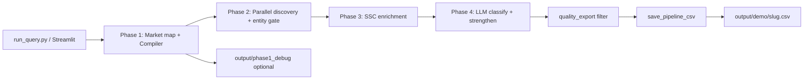

# Vendor Intelligence — Weekly Change Log

**Period covered:** May 29 – June 10, 2026  
**Scope:** Pipeline architecture, Phase 1–5 behaviour, search infrastructure, CSV/output layout, CLI/UI entry points, and demo workflow.

This document summarizes everything changed in the system during the past week — both **committed** work (git) and **local/uncommitted** improvements still on your working tree.

---

## 1. Executive summary

The project moved from a multi-script phase runner into a **single “quality pipeline”** optimized for **CEO-ready market landscape CSVs**:

| Before (early week) | After (now) |
|---------------------|-------------|
| Separate phase scripts, varied output folders | Unified `run_query.py` / `run_pipeline.py` → one orchestrator |
| Generic discovery prompts (many listicles) | LLM **market understanding** + value-chain prompts per function |
| Phase 2 only, or full CLI with 4 CSV types | **5-phase demo pipeline**: Plan → Discovery → Enrich → Classify → Export |
| Output scattered under `output/market_queries/` | **Demo folder:** `output/demo/` (configurable) |
| Weak / duplicated `Role_Description` cells | Dedicated CSV field logic + classifier prompts for CEO one-liners |
| Sequential DDG searches (~45–90 min discovery) | **DDG worker pool** + **parallel discovery batches** |
| No UI | **Streamlit app** (`app.py`) for runs, Phase 1 preview, results browser |

**Typical quality run today:** ~15–25 minutes, ~50–70 exported companies (market-dependent), e.g. Solar Inverter Market → **68 rows** from 131 classified.

---

## 2. Git history (committed)

| Date | Commit | Summary |
|------|--------|---------|
| May 29 | `4bd5eb2` | Initial commit — base vendor intelligence pipeline |
| Jun 3 | `0b0bbf0` | **Major quality pipeline commit** — orchestrator, enrichment, classification, entity gate, discovery fixes |

### What `0b0bbf0` introduced (50 files, ~6.5k lines added)

**New pipeline core**

- `src/vendor_intel/pipeline/orchestrator.py` — end-to-end async pipeline
- `src/vendor_intel/pipeline/quality_export.py` — post-classify export gate
- `src/vendor_intel/pipeline/entity_gate.py` — pre-classify junk filter (media, directories, gov)
- `src/vendor_intel/pipeline/geo_limits.py` — geography-aware discover/enrich/export caps
- `src/vendor_intel/pipeline/csv_fields.py` — CSV column helpers (initial version)
- `src/vendor_intel/pipeline/plan_seeds.py` — merge Phase 1 seeds into discovery list
- `src/vendor_intel/pipeline/llm_meter.py` — LLM call + cost tracking per run

**New intelligence layer**

- `src/vendor_intel/intelligence/classifier.py` — LLM company classification + landscape fields
- `src/vendor_intel/intelligence/signal_extractor.py` — crawl → structured signals
- `src/vendor_intel/enrichment/smart_enrichment.py` — parallel SSC / smart_crawl enrichment
- `src/vendor_intel/enrichment/ssc_fetch.py` — server-side content fetch path

**Phase 2 fast path**

- `src/vendor_intel/phase2/discovery_fast.py` — search-only discovery → `{name, domain}` list

**Discovery / compiler hardening**

- `src/vendor_intel/stages/compiler_coerce.py` — robust JSON coercion from LLM
- `src/vendor_intel/discovery/entity_extract.py` — stronger name/domain validation
- `src/vendor_intel/discovery/sector_tree.py` — sector-tree widen prompts
- `src/vendor_intel/utils/domain_corrections.py` — DNS/alias fixes (e.g. regional TLDs)

**Search infrastructure**

- `src/vendor_intel/clients/ddg_worker_pool.py` — multi-process DDG pool
- Updates to `duckduckgo.py`, `search_router.py`

**Entry points**

- `run_pipeline.py` — CLI wrapper for quality pipeline
- `crawler/smart_crawl.py` — large smart crawl engine (used by supplement paths)

**Docs**

- `PROJECT_HANDOFF.md` — expanded handoff / field guide

---

## 3. Local changes since Jun 3 (uncommitted — on working tree)

These are **not yet committed** but represent the bulk of demo-polish work from the past few days.

### 3.1 Phase 1 — market understanding & prompt quality

| Change | Files | Detail |
|--------|-------|--------|
| **Market map LLM (Sonnet)** | `funnel/market_understanding.py`, `config/prompts/market_understanding.txt` | Before compiling, an LLM call builds `market_definition`, **value_chain_layers**, segment-specific discovery prompts, and extra **seed companies** |
| **Compiler prompt rewrite** | `config/prompts/compiler_system.txt` | 8–12 discovery prompts covering full value chain; bans listicle patterns (`top 10`, `best companies`); industry-specific query templates (tech, software, energy, chemicals) |
| **Phase 1 smoke test** | `phase1/runner.py`, `stages/a_compiler.py` | Global smoke: up to 10 prompts; validates search stack before full 
run |
| **Phase 1 debug tool** | `test_phase1.py` (new) | Standalone inspector → `output/phase1_debug/<slug>.json` + `.md` with GOOD/WARN/FAIL verdict |
| **Scope schema** | `funnel/scope_schema.py` | Richer scope: `ecosystem_functions`, `relevance_keywords`, `negative_keywords`, `value_chain_layers` |

### 3.2 Phase 2 — discovery speed & quality

| Change | Files | Detail |
|--------|-------|--------|
| **Parallel search batches** | `stages/b_discovery.py`, `clients/search_router.py`, `duckduckgo.py` | Runs up to `DISCOVERY_PARALLEL_BATCH` (default **4**) prompts concurrently via DDG pool |
| **Repeat-query dedup** | `b_discovery.py` | Skips identical query text when widen/mutation passes reuse the same string |
| **Junk entity filter** | `discovery/candidate_quality.py`, `discovery/entity_extract.py` | Blocks generic words, listicle titles, media domains, wrong-industry names |
| **company_function tagging** | `candidate_quality.py` | Infers function (manufacturer, distributor, etc.) from source prompt text |
| **Dedupe threshold** | `utils/dedupe.py` | Less aggressive dedup (~0.92) to keep distinct brands |
| **Entity gate in Phase 2** | `phase2/discovery_fast.py`, `entity_gate.py` | Second pass removes market-research / marketplace / gov domains before enrich |
| **Widen loops** | `b_discovery.py`, `config.py` | Default `WIDEN_LOOP_MAX=3`; auto-boost to 5 widen passes when unique count &lt; 55 |
| **Volume / sector prompts** | `discovery/volume_prompts.py`, `discovery/seed_expansion.py`, `discovery/tier1_registry.py` | More targeted widen and seed-expansion queries |

### 3.3 Phase 3 — enrichment

| Change | Files | Detail |
|--------|-------|--------|
| **SSC-first enrichment** | `enrichment/smart_enrichment.py` | Default `PIPELINE_USE_SSC=true` — fast `ddgs_extract` / httpx path for ~131 companies in parallel (`PIPELINE_ENRICH_CONCURRENT=12`) |
| **Supplement crawl** | `smart_enrichment.py`, `classifier.py` | Second-pass crawl for thin sites during classify strengthen (can be slow/noisy on dead domains) |
| **Geo signals (legacy path)** | `validation/geo_signals.py` | Scope-driven geography keyword sets (India, US, Europe, etc.) for older Phase 3 validation — not used by the new quality orchestrator path |

### 3.4 Phase 4 — classification & export quality

| Change | Files | Detail |
|--------|-------|--------|
| **Quality classifier prompts** | `intelligence/classifier.py` | Separate `_SYSTEM_QUALITY` prompt: `role_description` = CEO market-fit line; `key_products` = comma list; `is_relevant` gate |
| **Strengthen / landscape fill** | `classifier.py` | Second LLM pass for weak rows (`_llm_strengthen_company`, `_apply_landscape_llm_fill`) |
| **Market relevance scoring** | `pipeline/market_relevance.py` (new) | Dynamic keyword profile from Phase 1 scope — not hardcoded per industry |
| **Participant domain helpers** | `pipeline/participant_domains.py` (new) | Market-research / marketplace domain detection |
| **Quality export gate** | `pipeline/quality_export.py` | Scores each row; rejects `not_relevant`, `non_product_site`, `market_research_site`, weak product fit, consulting-only, etc. |
| **VIP / seed bump** | `quality_export.py` | Registry seeds and known majors get relaxed gates |
| **Site kind classifier** | `validation/site_kind.py` | Media / directory / article-title detection |

### 3.5 CSV & Role_Description (major output quality work)

| Change | Files | Detail |
|--------|-------|--------|
| **`format_csv_role_description()`** | `pipeline/csv_fields.py` | Priority: LLM `role_description` → specific `company_function` line → blended product phrase — **never** a copy of `Key_Products` |
| **Reject generic templates** | `csv_fields.py` | Drops `vendor in {market}`, nav junk, schema keys, weak one-liners |
| **No trailing ellipsis** | `finalize_role_description()`, `trim_complete_phrase()` | CSV cells end on complete phrases (max ~72 chars) |
| **Key_Products trim** | `truncate_key_products()` | Comma list capped for spreadsheet readability |
| **Classifier alignment** | `classifier.py` | Prompts updated so LLM fills distinct `role_description` vs `key_products` |

**Final CSV columns (demo export):**

```
#, Company, Brand, Parent_or_Independent, Website, Industry, Role,
Role_Description, Key_Products, Geography, Confidence, Quality_Score,
Is_Relevant, Data_Sources
```

**Removed from demo CSV (by design):** `HQ_Country`, seed flags, internal debug columns.

### 3.6 Pipeline caps (volume increase)

| Setting | Old (approx.) | Current default |
|---------|---------------|-----------------|
| `PIPELINE_GLOBAL_DISCOVER_MAX` | 130 | **180** |
| `PIPELINE_GLOBAL_ENRICH_MAX` | 130 | **180** |
| `PIPELINE_GLOBAL_EXPORT_MAX_ROWS` | 120 | **160** |
| `PIPELINE_EXPORT_MAX_ROWS` (regional) | 100 | **140** |
| `MAX_FAST_COMPANIES` (Phase 2) | 150 | **180** |

Configured in: `config.py`, `geo_limits.py`, `.env.example`.

### 3.7 Output folder restructure (demo workflow)

| Item | Detail |
|------|--------|
| **New default output** | `output/demo/` |
| **Resolver module** | `src/vendor_intel/pipeline/output_paths.py` |
| **Env override** | `MARKET_QUERY_OUTPUT_DIR=output/demo` in `.env` |
| **Updated runners** | `run_query.py`, `run_market_queries.py`, `ui/bootstrap.py` |
| **Per-run artifacts** | `<slug>.csv`, `<slug>.json`, `session_log.json` |
| **Phase 1 debug (separate)** | `output/phase1_debug/<slug>.json` + `.md` via `test_phase1.py` |
| **Legacy folder** | `output/market_queries/` — older runs remain; new runs use `demo/` |

**Slug rule:** `{query}_{country}` lowercased, non-alphanumeric → `_`  
Example: `Solar Inverter Market` + `global` → `solar_inverter_market_global.csv`

### 3.8 CSV export filter (latest)

In `save_pipeline_csv()` (`orchestrator.py`):

- **Only `is_relevant=true` rows** are written to the demo CSV
- Full classified list still stored in JSON (`all_classified`, `export_rejected`)
- Phase 3/4 processing unchanged — filter is at **export time only** (per your request)

### 3.9 New entry points & UI

| File | Purpose |
|------|---------|
| `run_query.py` | Interactive / single-query runner (primary demo CLI) |
| `run_market_queries.py` | Batch from `queries/markets.txt` |
| `run_pipeline.py` | `--industry` / `--country` pipeline CLI |
| `test_phase1.py` | Phase 1-only validation |
| `app.py` | **Streamlit UI** — Home, Run Pipeline, Phase 1 Preview, Results, Batch, System Health |
| `ui/services.py` | Background job runner, pipeline invoke, session log |
| `queries/markets.txt` | Curated demo query list |
| `queries/phase1_validate.txt` | Phase 1 batch validation list |

**Streamlit geography:** free-text input (not dropdown) — same as CLI `--country`.

**Start UI:**

```powershell
.venv\Scripts\python.exe -m streamlit run app.py
```

→ http://localhost:8501

### 3.10 Search / infra tuning

| Setting | Purpose |
|---------|---------|
| `DDG_WORKER_COUNT=3` | Process pool for parallel searches |
| `DDG_POOL_BACKENDS=bing,google,duckduckgo` | Engine fallback chain |
| `DISCOVERY_PARALLEL_BATCH=4` | Concurrent prompt batches in Phase 2 |
| `DDGS_BACKENDS=bing,mojeek,google` | Primary ddgs.text backends |
| `CLASSIFIER_MODEL=claude-haiku-4-5` | Fast/cheap classify at scale |
| `MARKET_MAP_MODEL=claude-sonnet-4` | Rich Phase 1 market map |
| Circuit breaker / timeout tweaks | `ddg_worker_pool.py` — skip dead engines, ~22s timeout |

### 3.11 Items considered and reverted

| Item | Status |
|------|--------|
| **“Fast profile”** (&lt;30 min, lower caps, skip strengthen) | **Reverted** — user asked to remove |
| **Skip enrich for blocked domains** | **Reverted** — user wanted Phase 3/4 untouched |
| **Skip strengthen when `is_relevant=false`** | **Reverted** |
| **Entity gate always on in quality mode** | **Reverted** — quality mode can bypass gate when LLM available (original behaviour restored) |
| **`WIDEN_LOOP_MAX=1`** | **Reverted** to **3** + auto-boost |

---

## 4. Output changes — detailed reference

### 4.1 Folder layout (current)

```text
output/
├── demo/                          ← NEW default for full pipeline runs
│   ├── <market_slug>.csv          ← CEO demo CSV (relevant rows only)
│   ├── <market_slug>.json         ← Full pipeline result + metadata
│   └── session_log.json           ← Append-only run history
├── phase1_debug/                  ← Phase 1-only runs (test_phase1.py)
│   ├── <slug>.json
│   └── <slug>.md
├── phase1/                        ← Legacy Phase 1 plans (run_phase1.py)
├── phase2/                        ← Phase 2 JSON manifests
└── market_queries/                ← LEGACY — pre-demo folder
```

### 4.2 JSON result shape (demo pipeline)

Key fields in `<slug>.json`:

| Field | Meaning |
|-------|---------|
| `query` | Built query string |
| `query_context` | `{industry, country, functions}` |
| `scope` | Phase 1 scope object |
| `relevant_companies` | **Exported rows** (post quality_export) |
| `all_classified` | All classified companies |
| `export_rejected` | Dropped rows + `export_reject` reason |
| `phase2_company_count` | Raw discovery count |
| `after_entity_gate` | After dedupe/gate |
| `classified_count` | Phase 4 output count |
| `export_rejected_count` | Rows dropped at export |
| `elapsed_minutes` | Wall clock |
| `llm_usage` | `{llm_calls_total, classify_calls, estimated_cost_usd, ...}` |

### 4.3 Export reject reasons (observed)

From recent Solar Inverter run:

| Reason | Typical source |
|--------|----------------|
| `not_relevant` | Classifier marked non-participant |
| `non_product_site` | Directory / marketplace / blog |
| `market_research_site` | Research / news aggregators |
| `consulting_not_participant` | Pure consulting firms |
| `below_quality_threshold` | Low composite quality score |
| `weak_product_fit` | Strict product gate (scope-driven) |

### 4.4 session_log.json entries

Each successful `run_query.py` run appends:

```json
{
  "query": "...",
  "country": "global",
  "profile": "quality",
  "status": "ok",
  "companies_exported": 68,
  "elapsed_minutes": 24.3,
  "csv_path": "...",
  "completed_at": "ISO8601"
}
```

---

## 5. Markets validated this week

### Phase 1 debug (`test_phase1.py` — GOOD verdicts)

| Query | Geography |
|-------|-----------|
| Bio Based Ethylene Market | global |
| Atomic Clock Market | global |
| NC G-code Simulation Market | global |
| Smart Distributed Wind Infrastructure Market | global |
| Digital Signage System Market | global |
| ERP vendors | global |
| medical device coating | global |
| aluminium cladding brands | Europe |

### Full pipeline runs (quality profile)

| Query | Geography | Notes |
|-------|-----------|-------|
| Digital Signage System Market | global | Reference run ~56 exported companies |
| Solar Inverter Market | global | **68 exported** / 131 classified / ~24 min |
| (+ others from `queries/markets.txt`) | various | See batch list |

---

## 6. Architecture diagram (current demo pipeline)



**Profiles:**

| Profile | Behaviour |
|---------|-----------|
| `quality` (default) | Strict export gate, CEO CSV, no row padding |
| `balanced` | Middle ground |
| `recall` | More rows, lower gates, noisier |
| `deep` | Disables SSC shortcut (full crawl) |

---

## 7. Configuration cheat sheet

Copy from `.env.example`. Minimum for live demo:

```env
USE_MOCK_DATA=false
LLM_PROVIDER=anthropic
ANTHROPIC_API_KEY=...
COMPILER_MODEL=claude-haiku-4-5-20251001
CLASSIFIER_MODEL=claude-haiku-4-5-20251001
MARKET_MAP_MODEL=claude-sonnet-4-20250514
PIPELINE_PROFILE=quality
MARKET_QUERY_OUTPUT_DIR=output/demo
DDG_WORKER_COUNT=3
DISCOVERY_PARALLEL_BATCH=4
```

---

## 8. How to run (current recommended workflow)

### Single demo query (CLI)

```powershell
.venv\Scripts\python.exe run_query.py -q "Solar Inverter Market" --country global --profile quality
```

### Phase 1 only (fast check)

```powershell
.venv\Scripts\python.exe test_phase1.py -q "Your Market" --country Europe
```

### Re-export CSV from saved JSON

```powershell
$env:PYTHONPATH = "src"
.venv\Scripts\python.exe -c "
import json
from pathlib import Path
from vendor_intel.pipeline.orchestrator import save_pipeline_csv
p = Path('output/demo/solar_inverter_market_global.json')
save_pipeline_csv(json.loads(p.read_text(encoding='utf-8')), str(p.with_suffix('.csv')))
"
```

### Streamlit UI

```powershell
.venv\Scripts\python.exe -m streamlit run app.py
```

---

## 9. Known limitations & noise sources

1. **Discovery still picks up marketplaces** (Alibaba, India B2B directories) — most are filtered at export, but still cost enrich + classify LLM calls.
2. **Supplement crawl tracebacks** after pipeline completion — dead domains (`tiktok.com`, bad DNS) log errors without failing the run.
3. **Major brand role mislabels occasional** — e.g. SolarEdge as Distributor when Manufacturer expected; strengthen pass can over-correct.
4. **Uncommitted state** — ~3,700 lines modified + new files not in git; consider a commit before next deployment.
5. **India-heavy tail** on global queries — many small distributors surface from search index bias.

---

## 10. File index (new or heavily modified)

### New files (untracked)

```
app.py
run_query.py
run_market_queries.py
test_phase1.py
ui/bootstrap.py, ui/services.py, ui/styles.py
queries/markets.txt, queries/phase1_validate.txt
config/prompts/market_understanding.txt
config/tier1_markets.yaml
src/vendor_intel/pipeline/output_paths.py
src/vendor_intel/pipeline/market_relevance.py
src/vendor_intel/pipeline/participant_domains.py
src/vendor_intel/pipeline/export_profile.py
src/vendor_intel/funnel/market_understanding.py
src/vendor_intel/discovery/seed_expansion.py
src/vendor_intel/discovery/tier1_registry.py
src/vendor_intel/validation/geo_signals.py
.streamlit/config.toml
output/demo/.gitkeep
```

### Heavily modified (staged diff vs HEAD)

```
src/vendor_intel/intelligence/classifier.py      (+1014 lines)
src/vendor_intel/pipeline/csv_fields.py          (+682 lines)
src/vendor_intel/stages/b_discovery.py           (+357 lines)
src/vendor_intel/pipeline/quality_export.py      (+337 lines)
src/vendor_intel/intelligence/signal_extractor.py
src/vendor_intel/clients/ddg_worker_pool.py
src/vendor_intel/pipeline/orchestrator.py
config/prompts/compiler_system.txt
.env.example
```

---

## 11. Suggested next steps

1. **Git commit** the uncommitted demo pipeline work with a message like: *“Demo pipeline: market map, parallel discovery, CEO CSV export, Streamlit UI, output/demo folder”*
2. **Add marketplace domains** to Phase 2 entity gate (Alibaba, exportersindia, made-in-china) to save enrich/classify cost on global runs.
3. **Pin a “golden demo” query set** in `queries/markets.txt` with expected row counts for regression.
4. **Optional:** post-export CSV column `Is_Relevant` can be dropped from file since all rows are now `yes`.

---

*Generated: June 10, 2026 — reflects committed history + current working tree state.*
